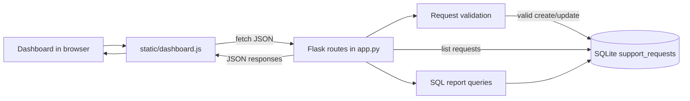

# Internal Workflow API Reporter Architecture

## Purpose And Scope

Internal Workflow API Reporter is a small local application for tracking internal support requests and reporting operational status. It is designed as a focused portfolio/demo project showing how business requirements become a database schema, REST-style API behavior, SQL reporting, validation rules, and a simple browser dashboard.

The initial scope is intentionally small:

- Create, list, and update support requests.
- Store request data in SQLite.
- Report request counts by status and priority.
- Render a JavaScript dashboard from API responses.
- Validate required fields and allowed workflow states.

Out of scope for the first implementation: authentication, multi-user permissions, external ticketing integrations, background jobs, production deployment, and complex notification workflows.

## Primary Users And Workflows

Primary users are internal operations or application-support staff who need a quick view of work entering, moving through, and leaving a support queue.

Key workflows:

1. A support request is submitted with requester, category, priority, status, owner, and notes.
2. The API validates the request and stores it in SQLite.
3. A user opens the dashboard and sees current requests in a table.
4. A user updates the status or owner of an existing request.
5. The report endpoint returns counts for open, blocked, and resolved work so the dashboard can show operational totals.

## Components

### Flask Application (`app.py`)

Owns HTTP routing, request validation, response formatting, and database access coordination.

Expected routes:

- `GET /` renders the dashboard shell from `templates/index.html`.
- `GET /api/requests` returns all support requests.
- `POST /api/requests` creates a new request after validation.
- `PATCH /api/requests/<id>` updates mutable fields such as status, owner, priority, and notes.
- `GET /api/reports/status` returns status counts.
- `GET /api/reports/priority` returns priority counts.

### SQLite Schema (`schema.sql`)

Defines the persistent request table and optional seed records. SQLite is used because the project is local, easy to run, and still demonstrates SQL design and reporting.

Primary table: `support_requests`

Suggested columns:

- `id` integer primary key
- `requester` text, required
- `category` text, required
- `priority` text, required
- `status` text, required
- `owner` text, required
- `notes` text, optional
- `created_at` text timestamp
- `updated_at` text timestamp

Allowed statuses should be centralized in `app.py` and enforced on create/update. Initial statuses: `open`, `blocked`, `resolved`.

Suggested priorities: `low`, `medium`, `high`, `critical`.

### Dashboard Template (`templates/index.html`)

Provides the browser page structure: summary counters, request table, create form, and update controls. The page should stay small and functional so the demo path is obvious.

### Dashboard JavaScript (`static/dashboard.js`)

Fetches API data, renders requests and report totals, submits new requests, and sends updates. It should handle API errors visibly in the page without requiring browser console inspection.

### Validation Checklist (`tests/test-checklist.md`)

Documents manual and lightweight test cases for API behavior, SQL report correctness, and dashboard behavior. This matches the initial one-hour scope while leaving a path to add automated tests later.

## Data Flow

## API Behavior

All API responses should be JSON. Successful create and update responses should include the stored request record. Validation failures should return HTTP 400 with an `error` field that explains the first actionable problem.

Validation rules:

- `requester`, `category`, `priority`, `status`, and `owner` are required for create.
- `category` cannot be blank.
- `owner` cannot be blank.
- `status` must be one of `open`, `blocked`, or `resolved`.
- `priority` should be one of `low`, `medium`, `high`, or `critical`.
- Updates should reject unknown fields rather than silently ignoring them.

## Error Handling

Expected errors should produce clear JSON:

- `400` for invalid input.
- `404` for missing request IDs.
- `405` for unsupported methods, handled by Flask.
- `500` only for unexpected failures.

The dashboard should show a concise error message near the affected control and keep the current data visible when a request fails.

## Security And Privacy

The first version is a local demo and should not collect sensitive personal data. Sample records should use fictional names and generic operational notes.

If this project later becomes deployable, add:

- Authentication and authorization.
- CSRF protection for browser-submitted mutations.
- Input length limits.
- Audit fields for user and timestamp.
- Migration tooling instead of direct schema resets.

## Operational Constraints

The app should run locally with Python, Flask, and SQLite. The database file should be generated locally and excluded from version control. The repo should include enough setup documentation for a reviewer to start the app, initialize the schema, and exercise the demo path.

## Testing Strategy

Initial testing is checklist-driven:

- API validation cases for missing category, invalid status, and empty owner.
- API happy path for create, list, update, and report endpoints.
- SQL checks that status and priority report totals match seeded and newly created records.
- Dashboard checks that table rows, counters, form submission, refresh behavior, and visible errors work.

Future automated tests can add Flask test-client coverage around route behavior and validation helpers once the first runnable skeleton is in place.
