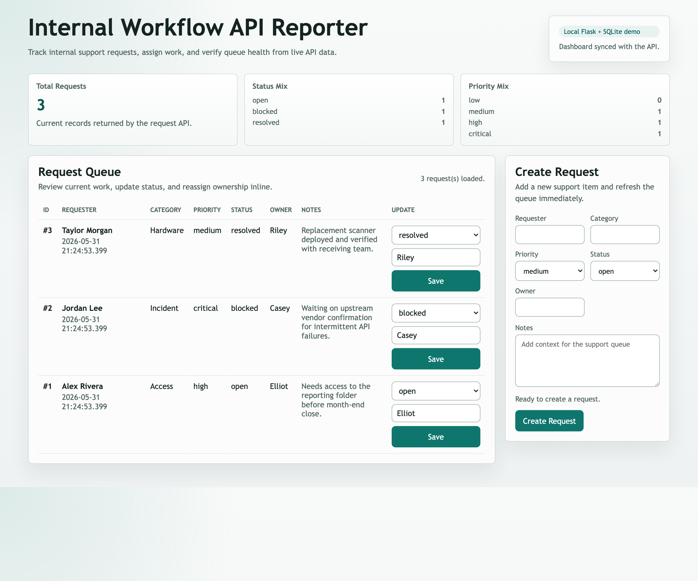

# Internal Workflow API Reporter

Internal Workflow API Reporter is a local Flask, SQLite, and JavaScript demo app for tracking internal support requests. It shows a practical support workflow: create requests, update ownership or status, view current queue data in a browser dashboard, and report counts by status and priority.

This repository is a complete local Flask, SQLite, and JavaScript demo for tracking internal support requests. It supports list, create, update, and reporting endpoints, plus a dashboard that creates requests, updates status and owner inline, and refreshes report summaries from live API data.

## App Preview



## Intended Demo Path

1. Start the Flask app locally.
2. Open the dashboard.
3. Create three support requests with different priorities and statuses.
4. Update one request from `open` to `blocked` or `resolved`.
5. Confirm the request table refreshes.
6. Confirm the report totals match the visible data.

## Current File Structure

```text
app.py
requirements.txt
schema.sql
static/dashboard.js
templates/index.html
tests/test-checklist.md
tests/smoke_test.py
README.md
ARCHITECTURE.md
```

## Prerequisites

- Python 3.11 or newer
- SQLite, usually included with Python
- A modern browser

## Installation

Create and activate a virtual environment:

```bash
python3 -m venv .venv
source .venv/bin/activate
```

Install dependencies:

```bash
pip install -r requirements.txt
```

## Configuration

The first version should run without required environment variables.

Optional variables:

- `FLASK_APP=app.py`
- `FLASK_DEBUG=1` for local development
- `DATABASE_PATH=/absolute/path/to/support_requests.db` to override the default database location

The SQLite database file should be local runtime state and should not be committed.

## Run Commands

Initialize the database:

```bash
sqlite3 support_requests.db < schema.sql
```

Run the app:

```bash
flask --app app run --debug
```

Then open:

```text
http://127.0.0.1:5000
```

Run the automated smoke test:

```bash
python tests/smoke_test.py
```

## Current API And Dashboard

List requests:

```bash
curl http://127.0.0.1:5000/api/requests
```

Current response shape:

```json
{
  "requests": [
    {
      "id": 1,
      "requester": "Alex Rivera",
      "category": "Access",
      "priority": "high",
      "status": "open",
      "owner": "Elliot",
      "notes": "Needs access to the reporting folder before month-end close.",
      "created_at": "2026-05-31 20:00:00",
      "updated_at": "2026-05-31 20:00:00"
    }
  ]
}
```

The exact timestamps will reflect when `schema.sql` is applied.

## API Examples

Create a request:

```bash
curl -i -X POST http://127.0.0.1:5000/api/requests \
  -H "Content-Type: application/json" \
  -d '{"requester":"Morgan Shaw","category":"Access","priority":"high","status":"open","owner":"Elliot","notes":"Needs access to reporting folder"}'
```

Update a request:

```bash
curl -i -X PATCH http://127.0.0.1:5000/api/requests/1 \
  -H "Content-Type: application/json" \
  -d '{"status":"resolved","notes":"Access granted"}'
```

Validation examples:

```bash
curl -i -X POST http://127.0.0.1:5000/api/requests \
  -H "Content-Type: application/json" \
  -d '{"requester":"Morgan Shaw","category":"","priority":"high","status":"open","owner":"Elliot"}'
```

```bash
curl -i -X PATCH http://127.0.0.1:5000/api/requests/999 \
  -H "Content-Type: application/json" \
  -d '{"status":"resolved"}'
```

View reports:

```bash
curl http://127.0.0.1:5000/api/reports/status
curl http://127.0.0.1:5000/api/reports/priority
```

Current report response shape:

```json
{
  "counts": [
    {"label": "open", "count": 1},
    {"label": "blocked", "count": 1},
    {"label": "resolved", "count": 1}
  ]
}
```

Dashboard behavior:

- Opening `/` loads the request queue and both report summaries.
- Submitting the create form adds a new support request and refreshes the table and counters.
- Each request row includes inline controls for updating `status` and `owner`.
- API validation errors are shown in the page instead of requiring console inspection.

## Verification

Use `python tests/smoke_test.py` for a quick end-to-end API and SQL verification. For manual browser checks, follow `tests/test-checklist.md`.

Manual coverage includes:

- Database initialization creates the `support_requests` table.
- Seed records include `open`, `blocked`, and `resolved` statuses.
- A direct SQL query lists the seeded requests.
- Creating a valid request returns `201` and the stored record.
- Updating a valid request returns `200` and the updated record.
- Creating without `category` returns `400`.
- Creating or updating with an invalid `status` returns `400`.
- Creating or updating with an invalid `priority` returns `400`.
- Creating or updating with an empty `owner` returns `400`.
- Updating a missing request ID returns `404`.
- Listing requests returns seeded and newly created data.
- Updating a request changes `updated_at`.
- Status and priority report totals match the database.
- Status and priority reports include stable labels even when a bucket has zero rows.
- Dashboard renders request rows from API data.
- Creating a request from the page refreshes the queue and report summaries.
- Updating status or owner from the page refreshes the queue and report summaries.
- Dashboard shows a visible error after invalid form submission.

## Implementation Notes

The project is intentionally local and inspectable. The backend keeps validation and reporting logic explicit, and the frontend uses plain JavaScript so the API behavior is easy to trace during a demo or interview walkthrough.
